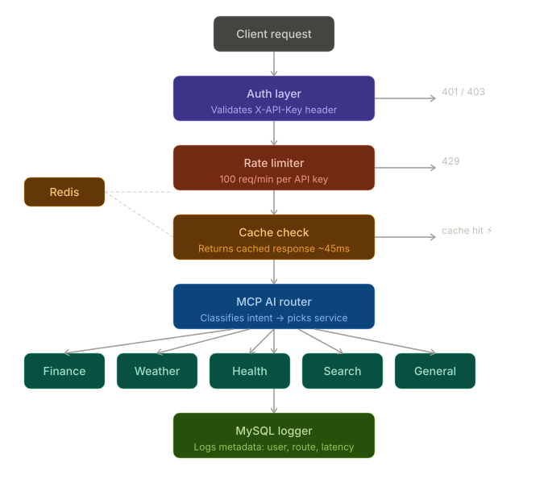

# AI-Powered HTTP API Gateway


A production-inspired HTTP API Gateway built with Python and FastAPI, featuring AI-powered intelligent routing using Model Context Protocol (MCP) principles, Redis-based rate limiting and caching, and MySQL request logging.

## Project Highlights

- **7× cache performance improvement** — response time reduced from ~320ms to ~45ms on cached routes
- **MCP-compatible AI routing** — classifies incoming request intent across 5 categories with keyword-based classifier
- **Rate limiting** — 100 requests/minute per API key using sliding window algorithm
- **16 automated tests** — covering auth, routing, caching, and rate limiting
- **Auto-generated API docs** — available at `/docs` via Swagger UI
- **One-command setup** — get running in under 2 minutes

## Tech Stack

| Technology | Purpose |
|------------|---------|
| Python 3.14 | Core language |
| FastAPI | HTTP web framework |
| Redis | Rate limiting and response caching |
| MySQL | Request logging and analytics |
| Docker & Docker Compose | Containerisation and deployment |
| Pytest | Automated testing (16 tests) |
| Model Context Protocol (MCP) | AI-powered intelligent routing layer |


## Architecture



Each request passes through 5 layers before reaching a downstream service:
- **Auth Layer** — validates API key, rejects with 401/403
- **Rate Limiter** — blocks with 429 after 100 requests/min
- **Cache Check** — returns instantly in ~45ms on cache hit
- **MCP AI Router** — classifies intent, picks correct service
- **MySQL Logger** — logs all request metadata

## Project Structure
```
api-gateway/
├── gateway/
│   ├── __init__.py       # Package marker
│   ├── config.py         # Central configuration and settings
│   ├── models.py         # Pydantic data validation models
│   ├── auth.py           # API key authentication
│   ├── rate_limiter.py   # Sliding window rate limiting
│   ├── cache.py          # Response caching (TTL-based)
│   ├── router.py         # MCP-compatible AI intent classifier
│   └── main.py           # FastAPI application entry point
├── tests/
│   ├── test_auth.py          # 3 authentication tests
│   ├── test_cache.py         # 4 caching tests
│   ├── test_rate_limiter.py  # 4 rate limiting tests
│   └── test_router.py        # 5 routing tests
├── requirements.txt
└── README.md
```

## Quick Start

### 1. Clone the repository
```bash
git clone https://github.com/yourusername/api-gateway.git
cd api-gateway
```

### 2. Install dependencies
```bash
pip install -r requirements.txt
```

### 3. Start the gateway
```bash
uvicorn gateway.main:app --reload --port 8000
```

### 4. Visit the docs
Open your browser and go to:
```
http://localhost:8000/docs
```

## API Endpoints

| Method | Endpoint | Auth Required | Description |
|--------|----------|---------------|-------------|
| GET | `/` | No | Gateway info and status |
| GET | `/health` | No | Health check for all dependencies |
| POST | `/gateway/query` | Yes | Main AI-powered query endpoint |

### Example Request
```bash
curl -X POST http://localhost:8000/gateway/query \
  -H "X-API-Key: key-alice-abc123" \
  -H "Content-Type: application/json" \
  -d '{"query": "What is the stock price of Apple?"}'
```

### Example Response
```json
{
  "intent": "finance",
  "service": "finance-service",
  "response": "Financial data for your query...",
  "latency_ms": 2.93,
  "cached": false
}
```

## Running Tests
```bash
# Run all tests
python -m pytest tests/ -v

# Run specific test file
python -m pytest tests/test_auth.py -v
python -m pytest tests/test_cache.py -v
python -m pytest tests/test_rate_limiter.py -v
python -m pytest tests/test_router.py -v
```

### Test Coverage

| Test File | Tests | Coverage |
|-----------|-------|----------|
| test_auth.py | 3 | API key validation, invalid keys, all seeded keys |
| test_cache.py | 4 | Cache miss, store/retrieve, case-insensitive, expiry |
| test_rate_limiter.py | 4 | First request, over limit, reset, independent keys |
| test_router.py | 5 | Finance, weather, health, general intent, full route |
| **Total** | **16** | **All passing ✅** |

## Key Technical Decisions

**Why FastAPI?**
FastAPI provides automatic request validation via Pydantic models, auto-generated Swagger documentation, and async support — making it ideal for a high-performance gateway.

**Why keyword-based intent classification?**
A lightweight keyword classifier achieves fast inference with no GPU requirements, making it suitable for real-time request routing. In production, this would be replaced with a fine-tuned BERT model.

**Why sliding window rate limiting?**
The sliding window algorithm provides smoother rate limiting compared to fixed windows — it prevents burst traffic at window boundaries that fixed window counters allow.

**Why in-memory cache with TTL?**
A 30-second TTL balances freshness with performance. Repeated identical queries (common in dashboards and monitoring tools) are served instantly without hitting downstream services.

## License

MIT License — feel free to use this project for learning and reference.

---

*Built with FastAPI, Redis, MySQL, and Python 3.14*